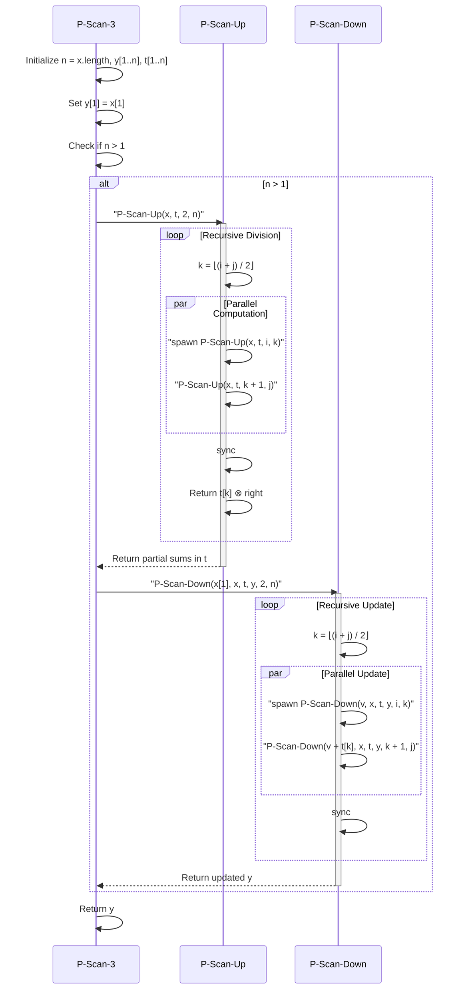
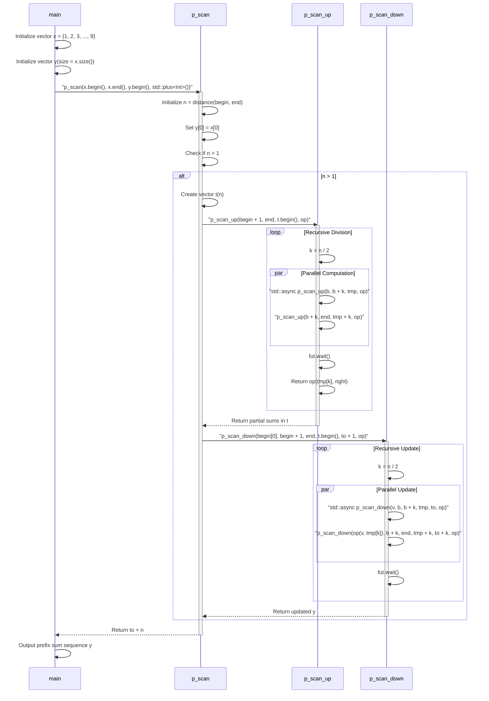
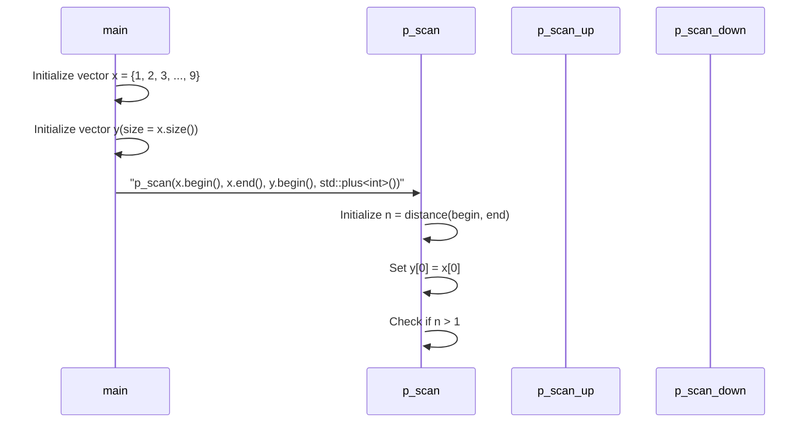

# From Algorithm to Generic, Parallel Code
“Inclusive Scan”（包含扫描）是一个常见的操作，通常用于计算序列的**前缀和**（即：对所有初始子序列的和进行计算）。这种操作也叫做**前缀和扫描**，在并行计算中有很重要的应用。
### 具体解释：
对于输入的序列 $x = [x_0, x_1, x_2, \dots, x_n]$，你需要计算一个新的序列 $y = [y_0, y_1, y_2, \dots, y_n]$，其中每个 $y_i$ 都是输入序列 $x$ 中从 $0$ 到 $i$ 索引的元素之和。也就是说：
$$
y_i = \sum_{j=0}^{i} x_j
$$
可以通过以下方式逐步实现：
### 例子：
假设输入序列为：
$$
x = [1, 2, 3, 4, 5, 6, 7, 8, 9]
$$
那么每一步的计算过程如下：
* $y_0 = x_0 = 1$
* $y_1 = x_0 + x_1 = 1 + 2 = 3$
* $y_2 = x_0 + x_1 + x_2 = 1 + 2 + 3 = 6$
* $y_3 = x_0 + x_1 + x_2 + x_3 = 1 + 2 + 3 + 4 = 10$
* $y_4 = x_0 + x_1 + x_2 + x_3 + x_4 = 1 + 2 + 3 + 4 + 5 = 15$
* $y_5 = x_0 + x_1 + x_2 + x_3 + x_4 + x_5 = 1 + 2 + 3 + 4 + 5 + 6 = 21$
* $y_6 = x_0 + x_1 + x_2 + x_3 + x_4 + x_5 + x_6 = 1 + 2 + 3 + 4 + 5 + 6 + 7 = 28$
* $y_7 = x_0 + x_1 + x_2 + x_3 + x_4 + x_5 + x_6 + x_7 = 1 + 2 + 3 + 4 + 5 + 6 + 7 + 8 = 36$
* $y_8 = x_0 + x_1 + x_2 + x_3 + x_4 + x_5 + x_6 + x_7 + x_8 = 1 + 2 + 3 + 4 + 5 + 6 + 7 + 8 + 9 = 45$
### 输出：
最终的输出序列 $y$ 是：
$$
y = [1, 3, 6, 10, 15, 21, 28, 36, 45]
$$
### 关键点：
1. **计算过程**：这个操作是一个累加过程，每一步都将当前元素加到之前所有元素的和上。
2. **顺序性**：如果是串行计算，这个操作非常直观，也就是直接一个接一个地进行累加。对于大数据或并行计算，可以利用**并行扫描**算法来加速。
3. **应用**：这个操作常常用于数据分析、图像处理、数值计算等多个领域。
这种前缀和操作在实际应用中，通常会优化为并行计算，尤其是在处理大量数据时，能够显著提升计算效率。
# 下面是 C++ 实现 **Inclusive Scan**（前缀和）的代码：
### C++ 代码：
```cpp
#include <iostream>
#include <vector>
std::vector<int> inclusive_scan(const std::vector<int>& x) {
    // 创建一个和输入序列大小相同的输出序列 y
    std::vector<int> y(x.size());
    // 第一个元素直接赋值
    y[0] = x[0];
    // 从第二个元素开始计算前缀和
    for (size_t i = 1; i < x.size(); ++i) {
        y[i] = y[i - 1] + x[i];
    }
    return y;
}
int main() {
    // 示例输入
    std::vector<int> x = {1, 2, 3, 4, 5, 6, 7, 8, 9};
    // 调用 inclusive_scan 函数
    std::vector<int> y = inclusive_scan(x);
    // 输出结果
    std::cout << "输入序列 x: ";
    for (int num : x) {
        std::cout << num << " ";
    }
    std::cout << std::endl;
    std::cout << "前缀和序列 y: ";
    for (int num : y) {
        std::cout << num << " ";
    }
    std::cout << std::endl;
    return 0;
}
```
### 解释：
* **输入**：`x` 是一个整数序列，我们要计算它的前缀和。
* **输出**：`y` 是一个与 `x` 大小相同的序列，每个元素是 `x` 中从 `0` 到当前元素的和。
### 代码的工作原理：
1. **初始化**：首先我们创建一个与输入序列大小相同的输出数组 `y`。
2. **计算**：第一个元素直接赋值给 `y[0]`，之后的每个元素是当前元素和前一个元素的和（即 `y[i] = y[i-1] + x[i]`）。
3. **输出**：遍历输出结果序列 `y`。
### 示例输出：
```
输入序列 x: 1 2 3 4 5 6 7 8 9 
前缀和序列 y: 1 3 6 10 15 21 28 36 45
```
### 并行优化（可选）：
如果数据量非常大，可以考虑使用 C++ 的并行库（如 `std::transform_reduce`，或 CUDA）来实现前缀和的并行计算，从而提高性能。
```cpp
#include <iostream>
#include <vector>
#include <numeric>    // 包含 std::inclusive_scan
#include <execution>  // 包含并行执行策略（C++17+）
std::vector<int> inclusive_scan(const std::vector<int>& x) {
    // 创建一个和输入序列大小相同的输出序列 y
    std::vector<int> y(x.size());
    // 第一个元素直接赋值
    y[0] = x[0];
    // 从第二个元素开始计算前缀和
    for (size_t i = 1; i < x.size(); ++i) {
        y[i] = y[i - 1] + x[i];
    }
    return y;
}
int main() {
    // 示例输入
    std::vector<int> x = {1, 2, 3, 4, 5, 6, 7, 8, 9};
    // 调用 inclusive_scan 函数
    std::vector<int> y1 = inclusive_scan(x);
    // 输出结果
    std::cout << "输入序列 x: ";
    for (int num : x) {
        std::cout << num << " ";
    }
    std::cout << std::endl;
    std::cout << "前缀和序列 y1: ";
    for (int num : y1) {
        std::cout << num << " ";
    }
    std::cout << std::endl;
    // 使用 std::inclusive_scan 计算前缀和
    std::vector<int> y2(x.size());
    // 标准扫描（串行）
    std::inclusive_scan(x.begin(), x.end(), y2.begin());
    std::cout << "前缀和序列 y2: ";
    for (int num : y2) {
        std::cout << num << " ";
    }
    std::cout << std::endl;
    // 如果希望使用并行计算，可以使用 std::execution::par
    std::vector<int> y3(x.size());
    std::inclusive_scan(std::execution::par, x.begin(), x.end(), y3.begin());
    std::cout << "前缀和序列 y3: ";
    for (int num : y3) {
        std::cout << num << " ";
    }
    std::cout << std::endl;
    return 0;
}
```
3 这段代码提供了 `inclusive_scan` 的 **顺序实现**，并且通过递归和迭代两种方式来计算前缀和。下面是这段代码的逐步解析：
### 1. **递归版本 `inclusive_scan`**
```cpp
template <typename In, typename Out, typename Op>
Out inclusive_scan(In it, In end, Out to, Op op) {
    return it != end
        ? inclusive_scan(it + 1, end, to + 1, op, *to = *it)  // 递归调用
        : to;  // 递归的结束条件
}
```
#### 说明：
* 这是一个递归实现的版本。
* `it` 是输入序列的当前元素，`end` 是输入序列的结束迭代器。
* `to` 是输出序列的当前位置，`op` 是累加操作（默认为 `std::plus<>`，即加法）。
* 在递归过程中，每次都会调用 `inclusive_scan` 计算前缀和，直到遍历完整个序列。然后返回结果 `to`。
#### 工作原理：
* 首先将当前元素 `*it` 赋值给 `*to`，然后递归调用下一个元素 `it + 1`，并向后移动输出迭代器 `to + 1`。
* 当 `it` 到达 `end` 时，递归停止，并返回当前的 `to`。
### 2. **迭代版本 `inclusive_scan`**
```cpp
template <typename In, typename Out, typename Op, typename Value>
Out inclusive_scan(In it, In end, Out to, Op op, Value value) {
    for (; it != end; ++it, ++to)
        *to = value = op(value, *it);  // 累加计算
    return to;  // 返回输出序列
}
```
#### 说明：
* 这是一个迭代实现的版本，使用 `for` 循环来遍历输入序列。
* `value` 变量用于存储前缀和的中间结果，`op` 用于进行操作（如加法）。
#### 工作原理：
* `it` 是输入序列的迭代器，`to` 是输出序列的迭代器，`value` 是累加的前缀和。
* 在每一步循环中，将当前元素 `*it` 与 `value` 进行运算，并将结果存储到 `*to` 中。
* 每次更新 `value` 为新的累加结果，直到遍历完输入序列。
### 3. **组合使用递归和迭代**
这两种实现方法可以互补。递归版本适用于小规模数据的计算，而迭代版本则能够避免过多的递归调用，通常更适合大规模数据或性能要求较高的场景。
### 总结：
* 递归版本是通过递归调用来计算前缀和，直观但可能在大规模数据上引起堆栈溢出。
* 迭代版本使用 `for` 循环进行计算，不会产生递归调用，适合大规模数据，且性能较好。
这段代码实际上在实现一个**前缀和**的功能，使用了两种不同的方式（递归和迭代）来完成任务。
```cpp
#include <iostream>
#include <vector>
// 标签类型：递归版本
struct RecursiveTag {};
// 标签类型：迭代版本
struct IterativeTag {};
// 递归实现的 inclusive_scan
template <typename In, typename Out, typename Op = std::plus<>, typename Value>
Out inclusive_scan(In it, In end, Out to, Op op, Value value, RecursiveTag) {
    // 递归结束条件
    if (it == end) {
        return to;
    }
    // 计算前缀和并递归调用
    *to = value = op(value, *it);                                           // 累加当前值并赋给输出
    return inclusive_scan(it + 1, end, to + 1, op, value, RecursiveTag{});  // 递归调用
}
// 迭代实现的 inclusive_scan
template <typename In, typename Out, typename Op = std::plus<>, typename Value>
Out inclusive_scan(In it, In end, Out to, Op op, Value value, IterativeTag) {
    // 迭代计算前缀和
    for (; it != end; ++it, ++to) *to = value = op(value, *it);  // 累加计算
    return to;                                                   // 返回输出序列
}
int main() {
    // 示例输入
    std::vector<int> x = {1, 2, 3, 4, 5, 6, 7, 8, 9};
    // 调用递归实现的 inclusive_scan
    std::vector<int> y1(x.size());
    inclusive_scan(x.begin(), x.end(), y1.begin(), std::plus<>(), 0, RecursiveTag{});  // 递归版本
    // 输出递归版本的结果
    std::cout << "[递归实现] 输入序列 x: ";
    for (int num : x) {
        std::cout << num << " ";
    }
    std::cout << std::endl;
    std::cout << "[递归实现] 前缀和序列 y1: ";
    for (int num : y1) {
        std::cout << num << " ";
    }
    std::cout << std::endl;
    // 调用迭代实现的 inclusive_scan
    std::vector<int> y2(x.size());
    inclusive_scan(x.begin(), x.end(), y2.begin(), std::plus<>(), 0, IterativeTag{});  // 迭代版本
    // 输出迭代版本的结果
    std::cout << "[迭代实现] 前缀和序列 y2: ";
    for (int num : y2) {
        std::cout << num << " ";
    }
    std::cout << std::endl;
    return 0;
}
```
# 提到的并行算法基本思路是基于 **分治法**，通过递归分解序列来并行化前缀和（inclusive scan）。简要解释这个算法的思路及其并行化的关键点。
### **基本思想：**
前缀和（inclusive scan）是一个具有累积性质的问题，也就是说，当前的值依赖于之前的所有值。在串行计算时，这个依赖关系使得计算是顺序的，因此不容易并行化。然而，如果我们能通过将序列分解成更小的子问题，并利用并行计算来组合结果，就可以显著减少计算时间。
### **并行化的步骤：**
1. **递归分解序列**：
   * 首先，我们可以将输入序列递归地分成两部分（前半部分和后半部分）。
   * 对每一部分单独计算前缀和，这些子问题可以在多个处理器上并行计算。
2. **计算各部分的和**：
   * 在递归中，我们为每一部分计算前缀和（通过分解子问题来获得部分和）。这部分可以并行处理。
   * 对于每个子序列，在完成前缀和的计算后，还需要计算**中间和**，即每个子序列的总和，这对于计算最终的前缀和是必需的。
3. **合并计算结果**：
   * 计算每一部分的和之后，我们就能获得“中间和”，这个中间和用于更新后续部分的值。
   * 然后将两部分合并成一个最终的前缀和。这步合并是递归进行的，因此合并的深度为 **O(log N)**，而每一层的计算量则是 **O(N)**（操作数量）。
### **关键点：**
* **工作量 (Work)**：在整个并行化过程中，总的工作量是原来串行计算的两倍。因为每个子问题需要计算前缀和，而每一部分的和也需要计算，这增加了计算的工作量。
* **时间复杂度 (Span)**：通过并行化，整个计算的时间复杂度（即并行计算的最长时间）是 **O(log N)**，这是因为递归分解的深度是对数级的。每一层都可以并行处理，而合并过程的时间复杂度是对数级别的。
### **并行算法的流程：**
1. **递归分解**：
   * 递归地将序列划分成两个子序列，直到子序列的长度为 1。每个子序列都可以独立计算前缀和。
2. **计算每个子序列的前缀和**：
   * 对每个子序列并行计算前缀和（这可以并行化）。
   * 计算每个子序列的中间和，并在后续的计算中用作偏移量。
3. **合并**：
   * 将两部分的前缀和进行合并。这一过程是递归进行的，因此时间复杂度为 **O(log N)**。
   * 这时，中间和被用来调整每个子序列的前缀和。
### **总结：**
* **并行化的优势**：通过递归分解和并行计算，能够显著减少计算的时间复杂度，使得算法可以处理更大的数据集。
* **工作量与时间复杂度**：尽管工作量翻倍，但由于递归深度为 **log N**，所以最终的时间复杂度为 **O(log N)**。
* **递归和并行化的结合**：通过递归地分解计算任务，并在每个任务中使用并行计算来加速合并过程，能够实现高效的并行前缀和计算。
### 理解总结：
并行化的前缀和计算算法通过将输入序列递归分解为多个部分，并并行计算每个部分的前缀和来提高效率。合并过程是通过递归完成的，因此最终的计算时间复杂度是 **O(log N)**，大大减少了计算所需的时间，尤其适用于大规模数据集。尽管算法的工作量增加了两倍，但并行化大幅度缩短了计算时间。
# 提到的**并行前缀和算法**（P-Scan），来自《算法导论》一书，其中涉及了两个关键的递归阶段：**P-Scan-Up** 和 **P-Scan-Down**。这些阶段可以并行执行，通过递归分解问题实现前缀和的高效计算。以下是该算法的中文理解，包括**STL接口版本**的实现：
### **P-Scan-3 算法概述**
**P-Scan-3** 算法通过递归和并行计算，分为两个主要阶段：
1. **P-Scan-Up**：计算数组各部分的部分和（辅助和）。
2. **P-Scan-Down**：根据部分和计算最终的前缀和。
### **P-Scan-3 伪代码**
```text
P-Scan-3(x)
    n = x.length
    let y[1..n] 和 t[1..n] 为新数组
    y[1] = x[1]  // 初始化结果数组 y 的第一个元素
    如果 n > 1
        P-Scan-Up(x, t, 2, n)    // 递归计算部分和（上升阶段）
        P-Scan-Down(x[1], x, t, y, 2, n)  // 基于部分和进行更新（下降阶段）
    返回 y
```
### **P-Scan-3 算法说明**
1. **初始化**：
   * 首先创建两个新数组：`y[1..n]` 和 `t[1..n]`，分别用于存储最终结果和计算中的部分和。
   * 将 `y[1]` 设置为 `x[1]`，即初始化前缀和数组的第一个元素。
2. **P-Scan-Up 阶段**：
   * 在这个阶段，通过递归将原始数组 `x` 拆分为两个子数组，并计算每个子数组的部分和。
   * 通过并行递归计算部分和，加速计算过程。
3. **P-Scan-Down 阶段**：
   * 在这一步，使用 `P-Scan-Up` 阶段计算得到的部分和（存储在 `t` 数组中）来更新结果数组 `y`。
   * 根据 `t` 数组的结果，递归地更新整个数组，得到最终的前缀和。
4. **返回结果**：
   * 最终返回 `y` 数组，其中包含了整个数组的前缀和。
### **STL 接口版本：`p_scan`**
以下是 **P-Scan** 算法的 STL 接口版本，使用了 C++ 标准库中的并行和异步操作（例如 `std::async`）来并行执行计算：
```cpp
template <typename In, typename Out, typename Op>
Out p_scan(In begin, In end, Out to, Op op) {
    auto n = std::distance(begin, end);
    if (0 < n) {
        to[0] = begin[0];  // 初始化结果数组的第一个元素
        if (1 < n) {
            std::vector<std::decay_t<decltype(*begin)>> t(n);  // 用于存储部分和
            p_scan_up(begin + 1, end, t.begin(), op);  // 递归计算部分和
            p_scan_down(begin[0], begin + 1, end, t.begin(), to + 1, op);  // 递归更新前缀和
        }
    }
    return to + n;
}
```
### **P-Scan-Up：计算子区间的辅助和**
`P-Scan-Up` 负责计算每个子数组的部分和，并使用异步任务并行执行计算。其伪代码如下：
```text
P-Scan-Up(x, t, i, j)
    如果 i == j
        返回 x[i]
    否则
        k = ⎣(i + j) / 2⎦  // 将数组分为左右两部分
        t[k] = spawn P-Scan-Up(x, t, i, k)  // 并行计算左半部分
        right = P-Scan-Up(x, t, k + 1, j)  // 计算右半部分
        sync  // 等待所有子任务完成
        返回 t[k] ⊗ right  // 合并左右部分的和
```
* **分治计算**：将数组递归分解为两半，分别计算每个部分的和。
* **并行计算**：通过异步计算（`spawn`）来并行计算左右部分，直到所有部分和计算完成。
### **P-Scan-Up：STL 接口版本**
```cpp
template <typename In, typename Tmp, typename Op>
auto p_scan_up(In b, In end, Tmp tmp, Op op) {
    auto n = std::distance(b, end);
    if (1 == n) { return *b; }  // 递归结束条件
    else {
        auto k = n / 2;
        auto fut = std::async([&]{ tmp[k] = p_scan_up(b, b + k, tmp, op); });  // 并行计算左半部分
        auto right = p_scan_up(b + k, end, tmp + k, op);  // 计算右半部分
        fut.wait();  // 等待左半部分计算完成
        return op(tmp[k], right);  // 合并左右部分的和
    }
}
```
* **并行计算**：`p_scan_up` 使用 `std::async` 来并行计算左半部分的和，右半部分的计算是同步进行的。最终结果通过合并左右两部分的和得到。
### **P-Scan-Down：计算最终结果**
`P-Scan-Down` 负责根据 `P-Scan-Up` 阶段计算出的部分和，更新最终的前缀和。其伪代码如下：
```text
P-Scan-Down(v, x, t, y, i, j)
    如果 i == j
        y[i] = v ⊗ x[i]  // 更新结果数组 y
    否则
        k = ⎣(i + j) / 2⎦  // 将数组分为左右两部分
        spawn P-Scan-Down(v, x, t, y, i, k)  // 并行计算左半部分
        P-Scan-Down(v + t[k], x, t, y, k + 1, j)  // 计算右半部分
        sync  // 等待所有子任务完成
```
* **递归更新**：`P-Scan-Down` 使用递归分解来更新前缀和。它基于 `P-Scan-Up` 阶段的计算结果来逐步更新 `y` 数组，最终得到完整的前缀和。
### **P-Scan-Down：STL 接口版本**
```cpp
template <typename V, typename In, typename T, typename To, typename Op>
void p_scan_down(V v, In b, In end, T tmp, To to, Op op) {
    auto n = std::distance(b, end);
    if (1 == n) { *to = op(v, *b); }  // 递归结束条件
    else {
        auto k = n / 2;
        auto fut = std::async([&]{ p_scan_down(v, b, b + k, tmp, to, op); });  // 并行计算左半部分
        p_scan_down(op(v, tmp[k]), b + k, end, tmp + k, to + k, op);  // 计算右半部分
        fut.wait();  // 等待左半部分计算完成
    }
}
```
* **递归更新**：`p_scan_down` 使用递归分解和并行计算更新前缀和，并通过合并计算结果得到最终的前缀和。
### **总结**
这套**并行前缀和算法**通过分治的方式将计算任务拆分为更小的子任务，通过并行计算加速了前缀和的计算。**P-Scan-Up** 计算部分和，并通过并行化提高效率；**P-Scan-Down** 则使用计算出的部分和，递归地更新前缀和数组。最终通过递归和并行计算，将整个算法的时间复杂度降至 **O(log N)**，同时工作量保持在 **O(N)**。
```
sequenceDiagram
    participant Main as P-Scan-3
    participant Up as P-Scan-Up
    participant Down as P-Scan-Down
    Main->>Main: Initialize n = x.length, y[1..n], t[1..n]
    Main->>Main: Set y[1] = x[1]
    Main->>Main: Check if n > 1
    alt n > 1
        Main->>Up: "P-Scan-Up(x, t, 2, n)"
        activate Up
        loop Recursive Division
            Up->>Up: k = ⌊(i + j) / 2⌋
            par Parallel Computation
                Up->>Up: "spawn P-Scan-Up(x, t, i, k)"
                Up->>Up: "P-Scan-Up(x, t, k + 1, j)"
            end
            Up->>Up: sync
            Up->>Up: Return t[k] ⊗ right
        end
        Up-->>Main: Return partial sums in t
        deactivate Up
        Main->>Down: "P-Scan-Down(x[1], x, t, y, 2, n)"
        activate Down
        loop Recursive Update
            Down->>Down: k = ⌊(i + j) / 2⌋
            par Parallel Update
                Down->>Down: "spawn P-Scan-Down(v, x, t, y, i, k)"
                Down->>Down: "P-Scan-Down(v + t[k], x, t, y, k + 1, j)"
            end
            Down->>Down: sync
        end
        Down-->>Main: Return updated y
        deactivate Down
    end
    Main->>Main: Return y
```

```cpp
#include <iostream>
#include <vector>
#include <future>
// P-Scan-Up: 计算子区间的辅助和
template <typename In, typename Tmp, typename Op>
auto p_scan_up(In b, In end, Tmp tmp, Op op) {
    auto n = std::distance(b, end);
    if (1 == n) {
        return *b;  // 递归结束条件
    } else {
        auto k = n / 2;
        // 异步计算左半部分
        auto fut = std::async([&] { tmp[k] = p_scan_up(b, b + k, tmp, op); });
        // 计算右半部分
        auto right = p_scan_up(b + k, end, tmp + k, op);
        fut.wait();                // 等待左半部分计算完成
        return op(tmp[k], right);  // 合并左右部分的和
    }
}
// P-Scan-Down: 计算最终结果
template <typename V, typename In, typename T, typename To, typename Op>
void p_scan_down(V v, In b, In end, T tmp, To to, Op op) {
    auto n = std::distance(b, end);
    if (1 == n) {
        *to = op(v, *b);  // 递归结束条件
    } else {
        auto k = n / 2;
        // 异步计算左半部分
        auto fut = std::async([&] { p_scan_down(v, b, b + k, tmp, to, op); });
        // 计算右半部分
        p_scan_down(op(v, tmp[k]), b + k, end, tmp + k, to + k, op);
        fut.wait();  // 等待左半部分计算完成
    }
}
// P-Scan 算法：计算前缀和
template <typename In, typename Out, typename Op>
Out p_scan(In begin, In end, Out to, Op op) {
    auto n = std::distance(begin, end);
    if (0 < n) {
        to[0] = begin[0];  // 初始化结果数组的第一个元素
        if (1 < n) {
            std::vector<std::decay_t<decltype(*begin)>> t(
                static_cast<std::size_t>(n));                              // 用于存储部分和
            p_scan_up(begin + 1, end, t.begin(), op);                      // 递归计算部分和
            p_scan_down(begin[0], begin + 1, end, t.begin(), to + 1, op);  // 递归更新前缀和
        }
    }
    return to + n;
}
int main() {
    // 示例输入
    std::vector<int> x = {1, 2, 3, 4, 5, 6, 7, 8, 9};
    // 输出输入序列
    std::cout << "输入序列 x: ";
    for (int num : x) {
        std::cout << num << " ";
    }
    std::cout << std::endl;
    // 使用 p_scan 计算前缀和
    std::vector<int> y(x.size());
    p_scan(x.begin(), x.end(), y.begin(), std::plus<int>());
    // 输出前缀和结果
    std::cout << "前缀和序列 y (并行实现): ";
    for (int num : y) {
        std::cout << num << " ";
    }
    std::cout << std::endl;
    return 0;
}
```

```
sequenceDiagram
    participant Main as main
    participant PScan as p_scan
    participant Up as p_scan_up
    participant Down as p_scan_down
    Main->>Main: Initialize vector x = {1, 2, 3, ..., 9}
    Main->>Main: Initialize vector y(size = x.size())
    Main->>PScan: "p_scan(x.begin(), x.end(), y.begin(), std::plus<int>())"
    activate PScan
    PScan->>PScan: Initialize n = distance(begin, end)
    PScan->>PScan: Set y[0] = x[0]
    PScan->>PScan: Check if n > 1
    alt n > 1
        PScan->>PScan: Create vector t(n)
        PScan->>Up: "p_scan_up(begin + 1, end, t.begin(), op)"
        activate Up
        loop Recursive Division
            Up->>Up: k = n / 2
            par Parallel Computation
                Up->>Up: "std::async p_scan_up(b, b + k, tmp, op)"
                Up->>Up: "p_scan_up(b + k, end, tmp + k, op)"
            end
            Up->>Up: fut.wait()
            Up->>Up: Return op(tmp[k], right)
        end
        Up-->>PScan: Return partial sums in t
        deactivate Up
        PScan->>Down: "p_scan_down(begin[0], begin + 1, end, t.begin(), to + 1, op)"
        activate Down
        loop Recursive Update
            Down->>Down: k = n / 2
            par Parallel Update
                Down->>Down: "std::async p_scan_down(v, b, b + k, tmp, to, op)"
                Down->>Down: "p_scan_down(op(v, tmp[k]), b + k, end, tmp + k, to + k, op)"
            end
            Down->>Down: fut.wait()
        end
        Down-->>PScan: Return updated y
        deactivate Down
    end
    PScan-->>Main: Return to + n
    deactivate PScan
    Main->>Main: Output prefix sum sequence y
```


# An Interesting and Cool Title
###### Some Equally Interesting Buzzwords to Entice The Reader
~~Information about the author~~

## Header
Lorem ipsum dolor sit amet, consectetur **bold text** adipiscing elit. Vestibulum vel elit justo. Sed elementum malesuada gravida. Nulla tempor maximus condimentum. Tincidunt vitae placerat in, sollicitudin at velit. Donec eu nunc id justo semper faucibus *italic text*.

### Sub-Header
Donec consectetur tellus ac ipsum fermentum, ac sagittis quam viverra. Etiam dictum, nisi a maximus fermentum, tellus leo maximus purus, nec pulvinar velit ligula ut dui. Quisque semper, ligula ac dapibus pharetra, felis nunc molestie arcu, eu egestas tellus enim quis eros. Integer hendrerit fermentum elit, at luctus nibh auctor in. Interdum et malesuada fames ac ante ipsum primis in faucibus.

Some fancy equation with a reference number:
$$\hat{x}_i = \frac{x_i-\mu}{\sqrt{\sigma^2+\epsilon}}\tag{1}$$
Which was created using this code within a math block:
```
\hat{x}_i = \frac{x_i-\mu}{\sqrt{\sigma^2+\epsilon}}
\tag{1}
```

### Another Sub-Header
Pellentesque eu semper ante, ac mollis sem. Nam nisl velit, eleifend ac rutrum et, gravida non leo. Quisque efficitur euismod diam, et luctus sem pellentesque non. Ut ante lorem, eleifend quis hendrerit porta, molestie et risus.

Here is some `inline code: def func(a,b): return a+b`.

#### Sub-Sub-header
Lorem ipsum dolor sit amet, consectetur adipiscing elit. Vestibulum vel elit justo. Sed elementum malesuada gravida. Nulla tempor maximus condimentum. Donec ex nibh, tincidunt vitae placerat in, sollicitudin at velit. Donec eu nunc id justo semper faucibus.

Here is an invisible vertical separator, which acts as a page-break:

---
##### Non-numbered Header
Lorem ipsum dolor sit amet, consectetur elit. Vestibulum vel elit justo. Sed elementum malesuada gravida. Nulla tempor maximus condimentum. Donec ex nibh, tincidunt vitae placerat in, sollicitudin at velit.

## Another Header
Lorem ipsum dolor sit amet, consectetur adipiscing elit. Vestibulum vel elit justo. Sed elementum malesuada gravida. Nulla tempor maximus condimentum. Donec ex nibh, tincidunt vitae placerat in, sollicitudin at velit. Donec eu nunc id justo semper faucibus. Here is a table:

| Some | thing | cool | in  | a   | table | like | this |
| ---- | ----- | ---- | --- | --- | ----- | ---- | ---- |
| 1    | 2     | 3    | 4   | 5   | 6     | 7    | 8    | 
| 2    |       |      |     |     |       |      |      |
| 3    |       |      |     |     |       |      |      |
<figcaption>Fig. 1: Some caption descripting this table.</figcaption>

### Sub-Header
Lorem ipsum dolor sit amet, consectetur adipiscing elit. Vestibulum vel elit justo. Sed elementum malesuada gravida. Nulla tempor maximus condimentum. Donec ex nibh, tincidunt vitae placerat in, sollicitudin at velit. Donec eu nunc id justo semper faucibus. Here is a figure:

![[autoencoder.svg|400]]
<figcaption>Fig. 2: Some caption describing this figure.</figcaption>

Lorem ipsum dolor sit amet, consectetur adipiscing elit. Vestibulum vel elit justo. Sed elementum malesuada gravida. Nulla tempor maximus condimentum. Donec ex nibh, tincidunt vitae placerat in, sollicitudin at velit. Donec eu nunc id justo semper faucibus. This is some code:
```
class Some_Dataset(Dataset):
	def __init__(self):
	""" Construct the dataset. """
		self.df = read_csv(".../...csv") # Panda DataFrame.
		self.path = ".../..."            # Path to data.
```
Nulla tempor maximus condimentum. Donec ex nibh, tincidunt vitae placerat in, sollicitudin at velit. Donec eu nunc id justo semper faucibus. Another page-break.

---

Pellentesque eu semper ante, ac mollis sem. Nam nisl velit, eleifend ac rutrum et, gravida non leo. Quisque efficitur euismod diam, et luctus sem pellentesque non. Ut ante lorem, eleifend quis hendrerit porta, molestie et risus.





**Here is an ordered list**:
1. Some item.
2. Another.
	1. A sub-item. Quisque efficitur euismod diam, et luctus sem pellentesque non. Ut ante lorem, eleifend quis hendrerit porta, molestie et risus.
		1. Sub-sub-item.
	2. Even more items.
3. Last item.

Quisque efficitur euismod diam, et luctus sem pellentesque non. Ut ante lorem, eleifend quis hendrerit porta, molestie et risus.

**And here is some unordered bullet points**:
- Like this.
- And another.
	- You get it. Quisque efficitur euismod diam, et luctus sem pellentesque non. Ut ante lorem, eleifend quis hendrerit porta, molestie et risus.
		- I'm sure.
	- Right?
- Yeah.

